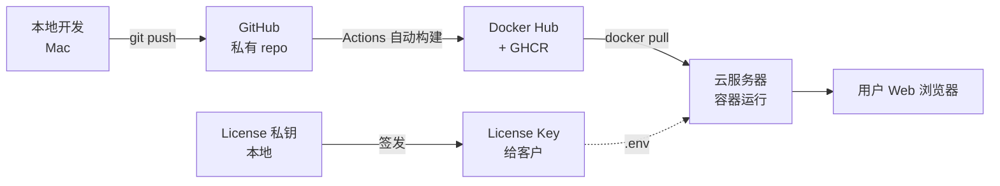

---
tags:
  - 续火花
  - 项目总览
created: 2026-04-19
project: douyin-spark
---

# 续火花 SaaS · 项目总览

> [!info] 项目定位
> 抖音"续火花"自动续签 SaaS 工具，闲鱼售卖（HU287，¥5-25），客户通过 web 后台管理多个抖音账号，每日定时自动给联系人发消息保持火花不断。

## 链路全景

## 仓库导航

- [[10-架构与技术栈]] —— 整体技术选型 / 模块划分
- [[20-部署流程]] —— 服务器一键部署 / 升级
- [[30-运维操作]] —— 密码 / License / 日志（最常用）
- [[40-开发流程]] —— 改代码 / 签 License / 推镜像
- [[50-故障排查]] —— 常见问题汇总
- [[90-命令速查]] —— 经常忘记的命令一页搞定
- [[91-URL 速查]] —— 所有相关地址

## 关键身份信息

| 项 | 值 |
|---|---|
| GitHub 账号 | `mrsxs` |
| GitHub 仓库 | https://github.com/mrsxs/douyin-spark （**私有**） |
| Docker Hub | `mrsxs/douyin-spark`（**公开**，免登录 pull） |
| GHCR | `ghcr.io/mrsxs/douyin-spark`（**私有**） |
| 部署 Gist | https://gist.github.com/mrsxs/eb80f17ecee1944c83deb5e0c33d2d78 |
| 续费 Gist | https://gist.github.com/mrsxs/6df87a305750bda46f721edff49c7df2 |
| 闲鱼商品 | https://m.tb.cn/h.iJuxIwu （口令 HU287） |

## 核心文件位置

### 本地（开发机）
| 路径 | 作用 |
|---|---|
| `/Users/apple/item/` | 源码仓库 |
| `license_private_key.pem` | **License 私钥**（绝密，签发用） |
| `license_public_key.pem` | License 公钥（已嵌入代码） |
| `tools/issue_license.py` | License 签发工具 |

### 服务器
| 路径 | 作用 |
|---|---|
| `/opt/douyin-spark/` | 部署根目录 |
| `/opt/douyin-spark/.env` | License + Captcha + 管理员密码 |
| `/opt/douyin-spark/docker-compose.yml` | 容器配置 |
| `/var/lib/docker/volumes/spark-data` | 数据 volume（cookies/DB/日志） |
