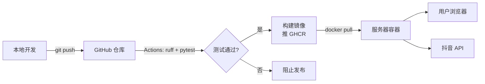

---
tags:
  - 续火花
  - 项目总览
created: 2026-04-19
updated: 2026-09-04
project: douyin-spark
---

# 续火花 · 项目总览

> [!info] 项目定位
> 抖音"续火花"自动续签工具，自托管 Web 面板。一个面板管多个抖音账号，每日定时自动给火花联系人发消息保持火花不断，可选接 LLM 做自动回复。
>
> **开源自部署，没有授权码 / 订阅 / 联网校验。** 拉起来注册第一个账号就能用。

## 链路全景

## 仓库导航

- [[10-架构与技术栈]] —— 整体技术选型 / 模块划分
- [[20-部署流程]] —— 一键部署 / 手动部署 / 升级
- [[30-运维操作]] —— 密码 / 备份 / 日志（最常用）
- [[40-开发流程]] —— 改代码 / 测试 / 推镜像
- [[60-抖音协议与签名]] —— 抖音 Web 协议 / a_bogus / request_sign / msToken
- [[61-抖音登录与续火花算法]] —— 扫码登录 / 短信登录 / 联系人解析 / 发消息 / 调度算法
- [[50-故障排查]] —— 常见问题汇总
- [[90-命令速查]] —— 经常忘记的命令一页搞定
- [[91-URL 速查]] —— 所有相关地址

面向使用者的文档在仓库根目录：[README](../README.md)（功能 + 快速开始）、[DEPLOY.md](../DEPLOY.md)（部署运维）、[Windows安装指南](../Windows安装指南.md)。

## 关键地址

| 项 | 值 |
|---|---|
| GitHub 仓库 | https://github.com/mrsxs/douyin-spark |
| 镜像（GHCR） | `ghcr.io/mrsxs/douyin-spark:latest` |

## 核心文件位置

### 仓库
| 路径 | 作用 |
|---|---|
| `app/` | FastAPI 应用（路由 / 业务 / 调度 / AI worker） |
| `douyin_im.py` | **抖音协议唯一出口**：签名、proto、所有抖音接口 |
| `lib/*.js` | Node 子进程签名脚本（a_bogus / req_sign） |
| `templates/` | Jinja2 模板 |
| `.harness/rules/` | 编码 / 流程 / 安全规范 |

### 部署机
| 路径 | 作用 |
|---|---|
| `/opt/douyin-spark/` | 部署根目录（非 root 时是 `~/douyin-spark`） |
| `.env` | 管理员密码哈希 + Captcha + 可选覆盖项 |
| `docker-compose.yml` | 容器配置 |
| `data/` | **全部状态**：`app.db` · `.secret_key` · 各账号 cookies/私钥 · 日志 |

> [!warning] 备份只需要一个目录
> `data/` 就是全部。里面的 `.secret_key` 丢了，所有加密入库的字段都解不开。
