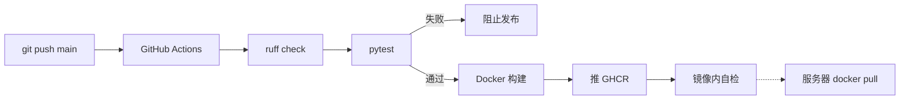

---
tags:
  - 续火花
  - 开发
created: 2026-04-19
updated: 2026-09-04
---

# 开发流程

> [!info] 上下文 [[00-总览]] · 部署 [[20-部署流程]]
>
> 规范细则在 [`.harness/rules/`](../.harness/rules/)；这里记的是链路和踩过的坑。

## 本地开发

```bash
git clone https://github.com/mrsxs/douyin-spark.git && cd douyin-spark

python -m venv .venv && source .venv/bin/activate
pip install -r requirements.txt -r requirements-dev.txt
npm install                     # jsrsasign，签名用，不能省
playwright install chromium     # 只有扫码登录需要

cp .env.example .env
python -m app.cli gen-secret                 # → SECRET_KEY
python -m app.cli hash-password 你的密码      # → ADMIN_PASSWORD_HASH

python run.py --port 8765 --reload
```

> [!danger] `npm install` 不能省
> `jsrsasign` 缺失时签名会失败，而抖音接口**仍然返回成功** —— 消息根本没投递。
> 这个「幽灵发送」是最难查的一类问题，因为所有日志都显示正常。

## 自证（提交前必做）

```bash
pytest -q                                 # 全量测试
ruff check app/ tests/ run.py             # 规则钉在 ruff.toml，不随 ruff 版本漂移
```

改了业务逻辑还要起服务在浏览器里真点一遍。强制 TDD，覆盖率门槛 80%，见
[开发流程规范](../.harness/rules/开发流程.md)。

## 自动构建链路



工作流在 [`.github/workflows/docker.yml`](../.github/workflows/docker.yml)。
PR 只跑测试不推镜像；push 到 `main` 才发布。

```bash
gh run list --limit 5
gh run view <run-id> --log-failed | tail -50
```

### 镜像内自检

构建完不是直接就算过 —— 还要把镜像跑起来做三件事（`tools/image_selfcheck.py`）：

1. 所有 router 都能 import
2. 起 uvicorn，`/healthz` 通
3. 走一遍表单登录路径（`Form(...)` 解析）

> [!warning] 为什么需要第 3 条
> 「镜像能 `docker run`」不等于应用能跑。曾经有一版所有 router 都 import 失败，
> 镜像照样通过了天真的 smoke test，然后在用户机器上崩溃循环 ——
> 是用户报日志上来才发现的。

> [!note] 自检脚本为什么单独放 `tools/` 而不内联进 YAML
> 内联的多行 python 会破坏 `run: |` 的 YAML 缩进（踩过），
> 而且独立文件能在本地直接跑。

## 修改代码 → 上线

```bash
# 1. 改代码 + 写测试
# 2. 自证
pytest -q && ruff check app/ tests/ run.py

# 3. 提交（Conventional Commits）
git add <改动的文件>
git commit -m "feat(scope): 描述"

# 4. 推之前扫一遍密钥
git diff --cached | grep -iE 'secret|password|private.?key|cookie'   # 应无真实值
git push

# 5. 等 Actions（约 5-10 分钟）
gh run list --limit 2

# 6. 服务器升级
ssh 服务器 && cd /opt/douyin-spark && docker compose pull && docker compose up -d
```

## 改部署脚本

`deploy.sh` / `manage.sh` / `manage.ps1` / `docker-compose.yml` 现在都在仓库里，
用户直接从 raw.githubusercontent.com 拉：

```
https://raw.githubusercontent.com/mrsxs/douyin-spark/main/<文件名>
```

改完 commit + push 就生效，**不再需要同步 Gist**（旧流程是私有 repo 时代的产物，
脚本必须放 Gist 才能公开访问，现在仓库本身就是公开的）。

改动后至少 `bash -n` 过一遍语法：

```bash
bash -n deploy.sh && bash -n manage.sh
```

## DB 迁移

没有 alembic，迁移是手写的，全在 `app/db.py:init_db()`：

- 加列 → 追加到 `add_columns` 列表，SQLite 没有 `IF NOT EXISTS`，靠 try/except 吞 duplicate
- 加索引 → 追加到 `ddl` 列表，用 `CREATE INDEX IF NOT EXISTS`
- 一次性数据迁移 → 单独写个 `_migrate_xxx()` 函数，**用 `app_settings` 里的标记位保证只跑一次**

> [!tip] 一次性迁移一定要有标记位
> 参考 `_migrate_drop_license()`：它把旧版本因未激活而 `max_accounts=0` 的用户抬到默认配额。
> 如果不加标记位，管理员之后故意把某人配额调回 0，下次重启又会被抬上去。

加列时要考虑**升级前后行为一致**：老库里已有的行拿到的是 DEFAULT 值，
所以默认值应该复刻旧行为，而不是新功能的推荐值。比如 `reply_share` 默认 0 ——
升级不该让谁的号突然开始自动回视频。
