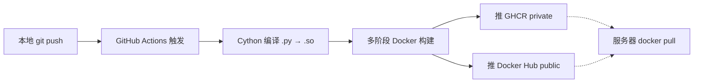

---
tags:
  - 续火花
  - 开发
created: 2026-04-19
---

# 开发流程

> [!info] 上下文 [[00-总览]] · 部署 [[20-部署流程]]

## 本地开发

```bash
cd /Users/apple/code/python/抖音续火花

# 装依赖
pip install -r requirements.txt
playwright install chromium

# 装 .env（开发用）
cp .env.example .env
# 改 ADMIN_USERNAME / ADMIN_PASSWORD_HASH / SECRET_KEY / DOUYIN_CAPTCHA_KEY

# 跳过 License 检查（仅开发）
SKIP_LICENSE_CHECK=1 python3 run.py --port 8765

# 浏览器
http://127.0.0.1:8765/
```

## 自动构建链路



每次 push 到 `main` 自动触发 [.github/workflows/docker.yml]，约 5-10 分钟构建并推双仓库。

查 Actions：
```bash
gh run list --limit 5
gh run view <run-id> --log-failed | tail -50
```

## 签发 License

> [!warning] 私钥安全
> `license_private_key.pem` 是 **license 签名私钥**，泄露 = 任何人都能伪造永久 license。
> - 已 chmod 600
> - 已加 .gitignore（永远不提交）
> - 永远不进 Docker 镜像
> - 建议另外加密备份到安全位置

### 命令

```bash
cd /Users/apple/code/python/抖音续火花

# 标准 365 天 pro
python3 tools/issue_license.py --days 365 --tier pro --note "客户备注"

# 试用 7 天
python3 tools/issue_license.py --days 7 --tier basic --note "试用"

# 严格模式：绑机器（客户先报机器码）
python3 tools/issue_license.py --days 365 --machine abc123def456 --note "严格"

# 输出长字符串（base64 payload + base64 RSA 签名）
# eyJ...xx==.yyy...
```

### 客户使用

把字符串发给客户，客户在服务器主菜单 [3] 续期或 [1] 首次安装时粘贴。

详见 [[30-运维操作#License 续期]]

## 修改代码 → 上线流程

```bash
cd /Users/apple/code/python/抖音续火花

# 1. 改代码
# 2. 本地测试（可选）
python3 -m py_compile app/your_changed_file.py
SKIP_LICENSE_CHECK=1 python3 run.py    # 浏览器验证

# 3. commit + push
git add 改动的文件
git commit -m "feat: 你的改动描述"
git push

# 4. 监控 Actions（约 5-10 分钟）
gh run list --limit 2

# 5. 服务器升级
ssh 服务器
cd /opt/douyin-spark
docker compose pull && docker compose up -d
```

## 改 manage.sh / docker-compose.yml

这两个在 **Gist 公开**（不在私有 repo），改完要单独同步：

```bash
# 改本地文件
vim /Users/apple/code/python/抖音续火花/manage.sh

# 推 gist
gh gist edit eb80f17ecee1944c83deb5e0c33d2d78 \
  -f manage.sh /Users/apple/code/python/抖音续火花/manage.sh

# 同时本地 commit
git add manage.sh && git commit -m "..." && git push

# 拿新 hash 给服务器用（绕 CDN 缓存）
gh api gists/eb80f17ecee1944c83deb5e0c33d2d78 --jq '.history[0].version'
```

服务器上重新拉：
```bash
HASH=刚才的 hash
curl -sL "https://gist.githubusercontent.com/mrsxs/eb80f17ecee1944c83deb5e0c33d2d78/raw/$HASH/manage.sh" -o manage.sh
```

## 重新生成 License 密钥对（紧急情况）

> [!danger] 影响极大
> 重新生成后所有现有 license **全部失效**，所有客户都要重新签 + 更新 .env。
> 仅在私钥泄露时执行。

```bash
cd /Users/apple/code/python/抖音续火花

# 备份旧的（万一有现有客户）
cp license_private_key.pem license_private_key.pem.OLD-$(date +%F)

# 生成新对
python3 -c "
from cryptography.hazmat.primitives import serialization
from cryptography.hazmat.primitives.asymmetric import rsa
priv = rsa.generate_private_key(public_exponent=65537, key_size=2048)
open('license_private_key.pem', 'wb').write(priv.private_bytes(
    serialization.Encoding.PEM,
    serialization.PrivateFormat.PKCS8,
    serialization.NoEncryption()))
open('license_public_key.pem', 'wb').write(priv.public_key().public_bytes(
    serialization.Encoding.PEM,
    serialization.PublicFormat.SubjectPublicKeyInfo))
import os; os.chmod('license_private_key.pem', 0o600)
print('done')
"

# 把新公钥粘到 app/license.py 的 _PUBLIC_KEY_PEM
cat license_public_key.pem
# 复制内容替换 app/license.py 里的常量

# 提交
git add app/license.py
git commit -m "security: 重新生成 license 密钥对"
git push

# 等 Actions 出新镜像，所有服务器拉新版 + 重新签 license
```
